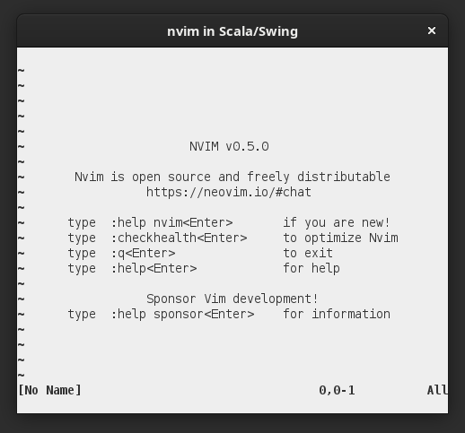

# NeovimSwing

## statement

A library to embed Neovim in a Swing/Java2D UI, written in Scala. Work in progress.
This project is (C)opyright 2021
by Hanns Holger Rutz. All rights reserved. This project is released under 
the [GNU Lesser General Public License](https://github.com/Sciss/NeovimSwing/raw/main/LICENSE) v2.1+ and comes with
absolutely no warranties. To contact the author, send an e-mail to `contact at sciss.de`.

## status

In 'alpha' state.

- keyboard interaction half done. still problems with some special keys, linux compose key doesn't seem to work
- playing around with [nvim-metals](https://github.com/scalameta/nvim-metals/); run `:MetalsImportBuild` when opening 
  an sbt project whose definitions changed.
- mouse control not yet implemented
- repaint should be more efficient (specify dirty rectangle)
- minimum supported API is directly encoded, in the future should be auto-generated from `--api-info`

## requirements / installation

This project builds with sbt against Scala 2.12, 2.13, 3 (JVM).

Use `sbt Test/run`. It assumes the `nvim` executable is on the `PATH`. Neovim 0.5.0 or higher is required.
Use `sbt 'Test/run --help'` to see options.

## linking

The following artifacts are available:

    "de.sciss" %% "neovim-swing" % v

The current version `v` is `"0.1.0"`.

## contributing

Please see the file [CONTRIBUTING.md](CONTRIBUTING.md)

## setting up nvim

clone the [repo](https://github.com/neovim/neovim/) and `git checkout -b stable stable` to select nvim 0.5.0.
Build via

    sudo apt install ninja-build gettext libtool libtool-bin autoconf automake g++ pkg-config unzip curl
    make distclean
    make CMAKE_BUILD_TYPE=Release -j4
    sudo make install

(usually also install `cmake`, but Debian's might be too old)

nvim-metals: install 'packer':

    git clone https://github.com/wbthomason/packer.nvim\
      ~/.local/share/nvim/site/pack/packer/start/packer.nvim

use as `~/.config/nvim/init.lua`: https://github.com/scalameta/nvim-metals/discussions/39

after first start of nvim, update packer plugins via `:PackerSync`.

## useful stuff (notes)

nvim uses [msgpack](https://msgpack.org/) to format its communication in remote procedure calls (RPC).
[msgpack-rpc spec](https://github.com/msgpack-rpc/msgpack-rpc/blob/master/spec.md).
msgpack libraries for Scala:

- [msgpack4z](https://github.com/msgpack4z/msgpack4z-core) - active project, sadly based on ScalaZ
- [airframe](https://github.com/wvlet/airframe) - seems to include msgpack support, but only low level?
  see also https://wvlet.org/airframe/docs/airframe-rpc.html -- looks like a good solution if we generate
  the serializers somehow. **Trying to use this one**.
- [scodec-msgpack](https://github.com/xuwei-k/scodec-msgpack) - based on scodec with shapeless as additional 
   dependency; seems up-to-date. Note: needs shapeless because it uses
   scodec 1.x instead of 2.x !
- [msgpack4s](https://github.com/velvia/msgpack4s) - unclear if still maintained
  
Scala projects communicating or integrating with nvim:

- [neovim-scala](https://github.com/fuyumatsuri/neovim-scala) - old project (2016), comes with its own
  [msgpack library](https://github.com/fuyumatsuri/msgpack-rpc-scala)
- [nvimhost-scala](https://github.com/viniarck/nvimhost-scala) - write plug-ins in Scala

JVM projects:

- [javafx-neovimpane](https://github.com/jebberjeb/javafx-neovimpane) - using Clojure and JavaFX embedding (2018)

Concealing wrapper code:

- https://www.reddit.com/r/neovim/comments/nc49bw/conceal_all_html_tags/
- https://vi.stackexchange.com/questions/5533/hide-certain-lines-completely-not-folding
- https://vi.stackexchange.com/questions/5175/is-there-a-way-to-conceal-across-lines

Creating debug logs: https://scalameta.org/metals/docs/contributors/getting-started/#json-rpc-trace

    # Linux
    touch ~/.cache/metals/lsp.trace.json # text editor
    touch ~/.cache/metals/bsp.trace.json # build server
